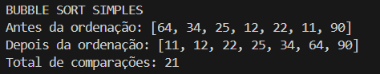
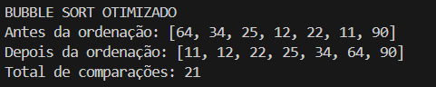
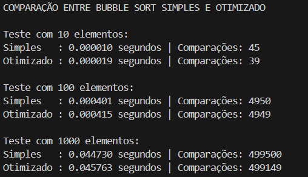

# 🧠 Atividade 01: Implementação do Algoritmo Bubble Sort

**Disciplina:** Estrutura de Dados II  
**Curso:** Análise e Desenvolvimento de Sistemas  
**Campus:** Patrocínio  
**Período:** 1º Semestre de 2025  
**Aluno:** Gabriel Henrique Moreira de Souza  
**Data de Entrega:** 26/03/2025  

---

## 📌 Objetivo da Atividade

O objetivo desta atividade é compreender e implementar o algoritmo de ordenação **Bubble Sort**, tanto na sua forma **simples** quanto em uma versão **otimizada**, além de realizar testes de desempenho com diferentes tamanhos de entrada.

---

## 💻 Implementações

### 🔸 Versão Simples

A versão tradicional percorre toda a lista, comparando e trocando elementos, sem considerar se a lista já está ordenada.

```python
def bubble_sort(lista):
    comparacoes = 0
    n = len(lista)
    for i in range(n):
        for j in range(0, n - i - 1):
            comparacoes += 1
            if lista[j] > lista[j + 1]:
                lista[j], lista[j + 1] = lista[j + 1], lista[j]
    return lista, comparacoes
```

---

### 🔹 Versão Otimizada

A versão otimizada verifica se houve trocas em cada passagem pela lista. Caso não haja, o algoritmo é encerrado antecipadamente.

```python
def bubble_sort_otimizado(lista):
    comparacoes = 0
    n = len(lista)
    for i in range(n):
        trocou = False
        for j in range(0, n - i - 1):
            comparacoes += 1
            if lista[j] > lista[j + 1]:
                lista[j], lista[j + 1] = lista[j + 1], lista[j]
                trocou = True
        if not trocou:
            break
    return lista, comparacoes
```

---

## 🧪 Execuções Individuais

### ✅ Execução da Versão Simples



---

### ✅ Execução da Versão Otimizada



---

## 📊 Teste Comparativo

Foi realizado um teste comparando as duas versões do algoritmo, com vetores contendo 10, 100 e 1000 elementos. Foram registrados o tempo de execução e o número de comparações (iterações).



---

## ✅ Conclusão

Ambos os algoritmos funcionam corretamente e ordenam os vetores conforme o esperado.  
A versão otimizada, embora possa realizar menos comparações em listas já ordenadas ou parcialmente ordenadas, nem sempre apresenta ganho de tempo em listas aleatórias. Isso acontece porque o ganho de desempenho só se destaca em casos específicos. Mesmo assim, a otimização é válida, pois evita iterações desnecessárias e representa uma boa prática de eficiência algorítmica.

---

## 👨‍💻 Autor

**Gabriel Henrique Moreira de Souza**
